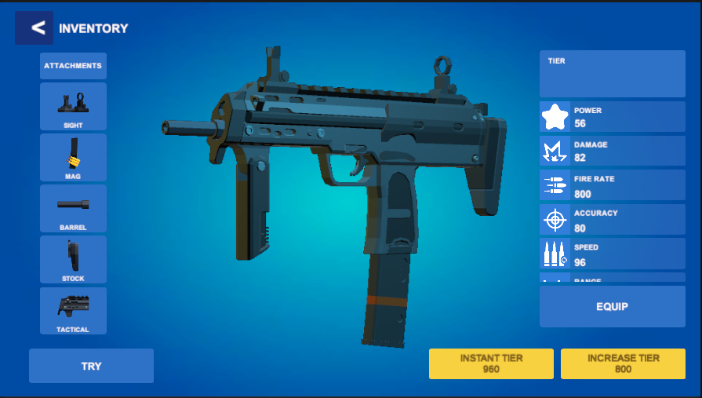
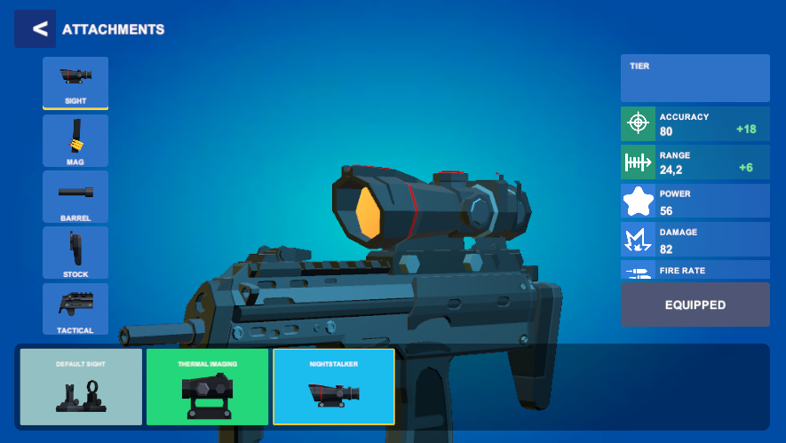

# Vertigo Games – Technical Artist Case Study  
## Task 1: UI Attachment System

This project demonstrates a functional weapon attachment UI built in Unity, featuring category switching, dynamic card strips, stat updates, smooth scrolling, and a real-time preview system.

---

## 🔧 What Works

- **Attachment Categories:** Sight / Mag / Barrel / Stock / Tactical  
- **Card Strip:** Selecting a card instantly updates the weapon model  
- **Equip State:** Selection persists when switching categories  
- **Stats Panel:** Row values and colors update based on stat deltas  
- **Preview Camera:** Predefined poses + smooth fit-to-node transitions  
- **Smooth Scroll:** Soft, clamped horizontal movement for card strips  

---

## 📁 Code Location
Assets/Task1_UI/Scripts/

yaml
Copy code

Main controller: **AttachmentManager.cs**  
(Handles UI flow, card population, stat syncing, and preview transitions.)

---

## ▶️ How to Test

1. Open the scene:
Assets/Task1_UI/Scenes/UI_Attachment.unity

yaml
Copy code
2. Press **Play**  
3. Click different categories → card strip updates  
4. Select a card → weapon model + stats update accordingly  

---

## 🖼 UI Attachment Preview

Below are three preview screenshots showcasing the UI Attachment system in action:

  
  
  

---

## ✔ Notes

- Designed for clarity and modularity — all logic is separated by responsibility.  
- Variables kept inspector-friendly for quick iteration during production.  
- Runs on **Unity 2022.3 LTS** (as used in the case study).

---

## 👤 Author  
**Deniz Özkan**  
Technical Artist / 3D Artist  
GitHub: https://github.com/denizozkanart

---
